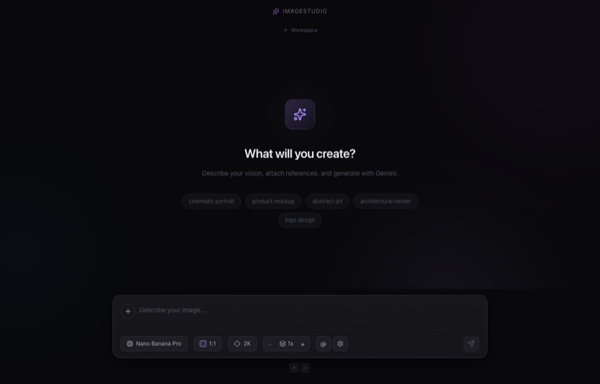

<p align="center">
  
</p>

<h1 align="center">ImageStudio</h1>

<p align="center">
  A beautiful, open-source desktop app for AI image generation.<br/>
  Generate, iterate, organize — all in one place.
</p>

<p align="center">
  
  
  
</p>

---

<p align="center">
  
</p>

## What is ImageStudio?

ImageStudio is a native macOS app that lets you generate images using the best AI models — all through a single, polished interface. No browser tabs, no subscriptions, no clutter. Just you, your prompts, and your images.

You bring your own [OpenRouter](https://openrouter.ai) API key and pay only for what you use. ImageStudio supports multiple models from different providers, so you can compare results side by side.

---

## Getting Started

### 1. Install

```bash
git clone https://github.com/ibimspumo/ImageStudio.git
cd ImageStudio
npm install
```

### 2. Run

```bash
npm run dev
```

### 3. Add your API key

When you first open ImageStudio, a settings dialog appears. Paste your [OpenRouter API key](https://openrouter.ai/keys) and you're ready to go.

<p align="center">
  
</p>

---

## Generating Images

Type your prompt into the prompt bar at the bottom. Press **⌘ Enter** to generate. That's it.

<p align="center">
  
</p>

The prompt bar gives you full control over your generation:

- **+** button (left of the text field) — attach reference images for image-to-image editing
- **Model selector** — choose which AI model to use
- **Aspect ratio** — pick from presets or define a custom ratio
- **Resolution** — 1K, 2K, or 4K output
- **Image count** — generate up to 4 images at once
- **@** button — open your asset collections
- **⚙** — settings

Everything is non-blocking. You can fire off multiple generations and keep prompting while they render.

---

## Choosing a Model

ImageStudio supports 7 models from different providers. Click the model selector in the prompt bar to switch between them:

<p align="center">
  
</p>

| Model | Provider | Notes |
|---|---|---|
| **Nano Banana Pro** | Google | Default. Fast, high quality. (Gemini 3.0 Pro) |
| **Nano Banana 2** | Google | Gemini 3.1 Flash — faster variant |
| **Riverflow 2 Pro** | Sourceful | Creative, artistic style |
| **Seedream 4.5** | ByteDance | Strong at photorealism |
| **GPT 5 Image mini** | OpenAI | Compact, fast |
| **GPT 5 Image** | OpenAI | Full-size, highest detail |
| **FLUX.2 Max** | Black Forest Labs | Excellent prompt following |

### Compare models side by side

Select multiple models using the checkboxes, then generate. ImageStudio fires off a request to each model in parallel, so you get results from all of them at the same time. Great for finding out which model handles your prompt best.

---

## Aspect Ratios

Click the aspect ratio button to choose from 10 presets — each shown as a visual box so you can immediately see the shape. Need something custom? Use the custom ratio input at the bottom with a live preview.

<p align="center">
  
</p>

**Presets:** 1:1, 3:4, 4:3, 2:3, 3:2, 9:16, 16:9, 5:4, 4:5, 21:9

**Custom:** Enter any width:height ratio (e.g. 7:3) and click Apply.

---

## Reference Images & Collections

### Attach reference images

Click the **+** button in the prompt bar or drag & drop images directly onto it. These are sent alongside your prompt for image-to-image editing — style transfer, face swaps, composition matching, etc.

### Asset Collections

Create named groups of reference images (e.g. `@brand-photos`, `@product-shots`). Type **@** in the prompt to mention a collection inline. The images are automatically prepared and attached.

Collections with more than 5 images are intelligently composited into grid layouts to stay within API limits.

---

## Image Chat Mode

Want to iteratively refine an image? Hover over any image in the gallery and click the chat icon. This opens a conversation where each message builds on the previous result.

- The last generated image is automatically attached as a reference
- You can switch models between messages
- You can attach additional reference images
- All chat-generated images also appear in your gallery

When you open a chat from an image, the model that originally created that image is pre-selected — so you continue with the same model by default.

---

## Workspaces

As your gallery grows, workspaces help you stay organized. Think of them as lightweight folders for your images.

- **By default, you work without a workspace** — all images are visible
- Click **+ Workspace** below the title bar to create one
- When a workspace is active, new generations automatically go into it
- Move existing images between workspaces via the folder icon on hover
- Switch back to **All** to see everything

Each workspace gets its own color. Images in a workspace show a subtle colored bar at the bottom. Right-click a workspace tab to rename or delete it.

---

## Lightbox & Image Details

Click any image to open it in the lightbox. The info panel on the right shows:

- **Prompt** — with a copy button
- **Model** — which AI model was used (shown as a readable name)
- **Size** — aspect ratio, resolution, and pixel dimensions
- **Duration** — how long the generation took
- **Date** — when the image was created
- **Chat origin** — if the image came from a chat, you can click to reopen it
- **Reference images** — any images that were attached during generation

### Actions

- **Reuse Prompt** — paste the prompt back into the prompt bar
- **Start Chat / Continue Chat** — open an editing conversation from this image
- **Copy** — copy the image to your clipboard
- **Save** — quick export as PNG, or click the dropdown arrow to choose format and quality
- **Delete** — remove from your gallery

### Export with format & quality

Click the dropdown arrow next to "Save" to open the export options:

- **Format** — PNG, JPEG, or WebP
- **Quality slider** — for JPEG and WebP, adjust from 10% to 100%
- **Live file size** — see the estimated file size update in real time as you change settings
- **Savings indicator** — shows how much smaller the file is compared to the original

---

## Keyboard Shortcuts

| Shortcut | Action |
|---|---|
| `⌘ Enter` | Generate images |
| `@` | Reference images/collections in prompt |
| `←` `→` | Navigate images in lightbox |
| `Escape` | Close lightbox, chat, or dialogs |

---

## Tech Stack

| Layer | Technology |
|---|---|
| Framework | [Electron](https://www.electronjs.org/) + [electron-vite](https://electron-vite.org/) |
| UI | [React 19](https://react.dev/) + [TypeScript](https://www.typescriptlang.org/) |
| Styling | [Tailwind CSS v4](https://tailwindcss.com/) |
| State | [Zustand](https://zustand.docs.pmnd.rs/) |
| Icons | [Lucide React](https://lucide.dev/) |
| AI | [OpenRouter API](https://openrouter.ai/) |

---

## Building for Production

```bash
npm run build
```

This creates a distributable macOS app in the `dist/` directory.

---

## Architecture

```
src/
├── main/                 # Electron main process
│   ├── ipc/              # IPC handlers (generation, files, settings)
│   └── services/         # OpenRouter client, image storage
├── preload/              # Typed context bridge (window.api)
└── renderer/src/         # React UI
    ├── components/
    │   ├── input/        # PromptBar, ModelSelector, AspectRatio, Resolution
    │   ├── gallery/      # Masonry grid, image cards
    │   ├── chat/         # Image chat modal
    │   ├── workspace/    # Workspace tabs and management
    │   ├── collections/  # Asset collection manager
    │   └── shared/       # Lightbox, export, settings, dialogs
    ├── stores/           # Zustand (gallery, collections, chat, settings, workspace)
    ├── hooks/            # useImageGeneration, useChatGeneration
    ├── types/            # API types, model definitions
    └── lib/              # Utils, image compression
```

---

## Data & Privacy

- Your API key is stored locally in `~/Library/Application Support/Electron/`
- All images and settings are stored locally on your machine
- ImageStudio never sends data anywhere except to OpenRouter for image generation
- No analytics, no tracking, no accounts

---

## License

MIT — free and open source. Do whatever you want with it.

## Contributing

Contributions are welcome. Please open an issue first for major changes.
