<p align="center">
  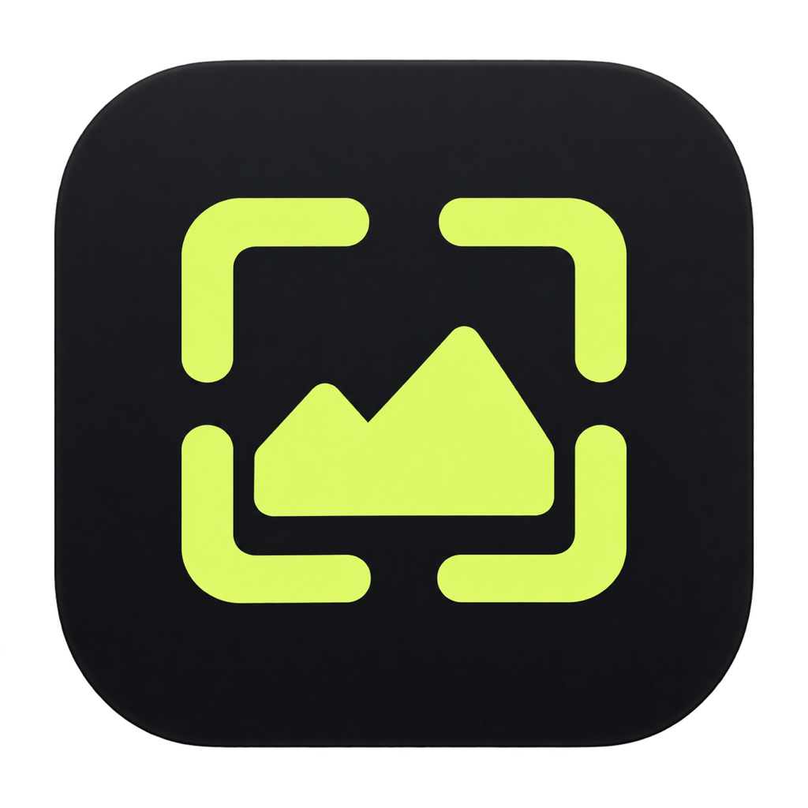
</p>

<h1 align="center">ImageStudio</h1>

<p align="center">
  A beautiful, open-source desktop app for AI image generation.<br/>
  Generate, iterate, organize — all in one place.
</p>

<p align="center">
  
  
  
</p>

---

<p align="center">
  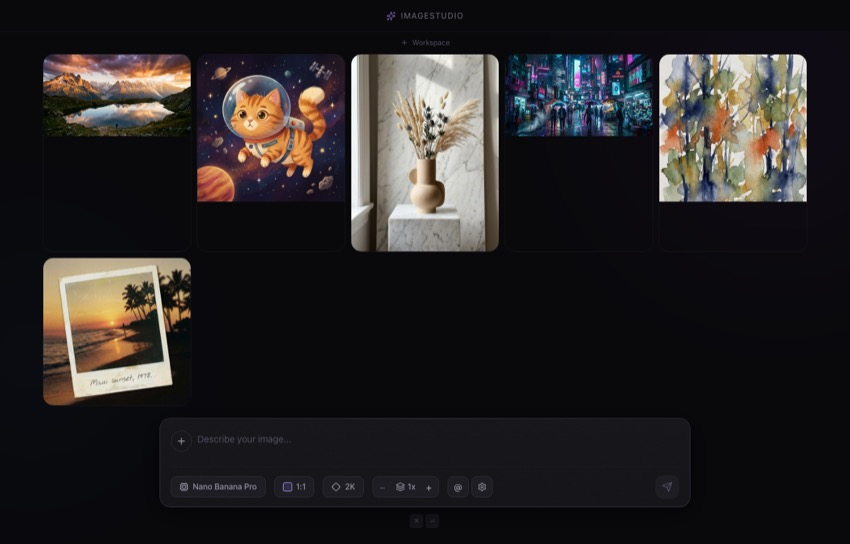
</p>

## What is ImageStudio?

ImageStudio is a native macOS app that lets you generate images using the best AI models — all through a single, polished interface. No browser tabs, no subscriptions, no clutter. Just you, your prompts, and your images.

You bring your own [OpenRouter](https://openrouter.ai) API key and pay only for what you use. ImageStudio supports multiple models from different providers, so you can compare results side by side.

---

## Download

Download the latest `.dmg` from the [Releases](https://github.com/ibimspumo/ImageStudio/releases) page.

> **Note:** ImageStudio is not signed with an Apple Developer certificate. macOS will block it on first launch. To fix this, open Terminal and run:
>
> ```bash
> xattr -r -d com.apple.quarantine /Applications/ImageStudio.app
> ```
>
> Then open ImageStudio normally from your Applications folder.

### Build from source

```bash
git clone https://github.com/ibimspumo/ImageStudio.git
cd ImageStudio
npm install
npm run dev          # Development with hot reload
npm run build:mac    # Build distributable .dmg
```

---

## Getting Started

When you first open ImageStudio, a settings dialog appears. Paste your [OpenRouter API key](https://openrouter.ai/keys) and you're ready to go.

<p align="center">
  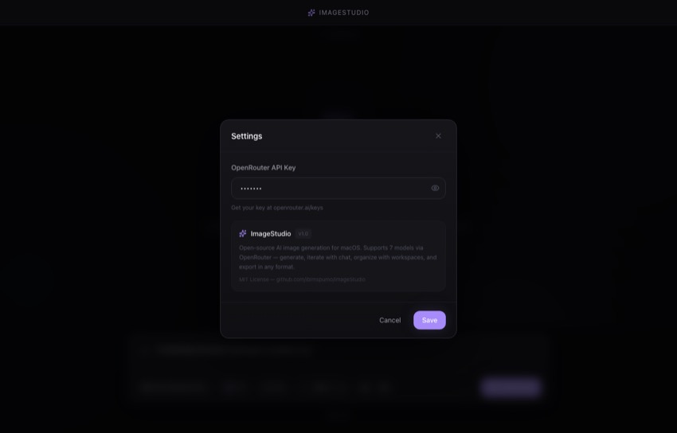
</p>

### Send images as URL (optional)

In Settings, you can enable **"Send images as URL"**. When active, reference images are uploaded to a free temporary host ([litterbox.catbox.moe](https://litterbox.catbox.moe)) and sent as HTTPS links instead of base64. This can improve how some models handle your prompts.

- Images auto-delete after 1 hour
- Identical images are cached and only uploaded once (important for multi-model generation)
- Upload status is shown on loading placeholders ("Uploading images...")
- If upload fails, ImageStudio silently falls back to base64
- Works across all features: generation, chat, zoom out, collections
- Default: **off** (standard base64 encoding)

---

## Generating Images

Type your prompt into the prompt bar at the bottom. Press **⌘ Enter** to generate.

<p align="center">
  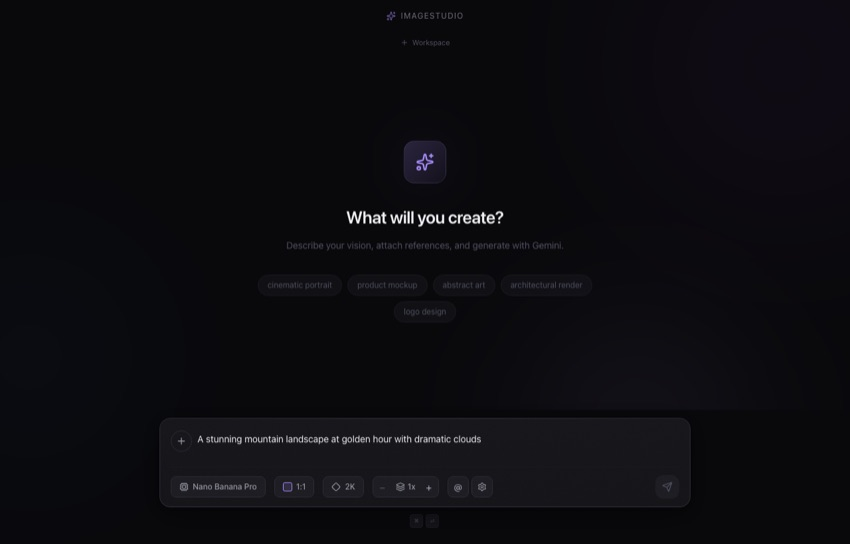
</p>

The prompt bar gives you full control over your generation:

- **+** button — attach reference images (moves above the text when images are attached)
- **Model selector** — choose which AI model to use (select multiple to compare)
- **Aspect ratio** — pick from 10 visual presets or define a custom ratio
- **Resolution** — 1K, 2K, or 4K output
- **Image count** — generate up to 4 images at once
- **Seed** — lock a seed for reproducible results (dice icon)
- **Negative prompt** — toggle to describe what to avoid (minus icon)
- **Style preset** — append predefined style suffixes to your prompt
- **Prompt enhancer** — AI-powered prompt improvement (wand icon)
- **@** button — open your asset collections
- **Queue** — batch processing queue status
- **Clear** (⊗) — clear the current prompt, attachments, and collection references
- **⚙** — settings & about

Everything is non-blocking. You can fire off multiple generations and keep prompting while they render.

---

## Choosing a Model

ImageStudio supports 7 models from different providers. Click the model selector in the prompt bar to switch between them:

<p align="center">
  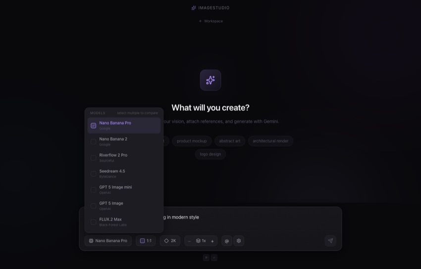
</p>

| Model | Provider | Notes |
|---|---|---|
| **Nano Banana Pro** | Google | Default. Fast, high quality. (Gemini 3.0 Pro) |
| **Nano Banana 2** | Google | Gemini 3.1 Flash — faster variant |
| **Riverflow 2 Pro** | Sourceful | Creative, artistic style |
| **Seedream 4.5** | ByteDance | Strong at photorealism |
| **GPT 5 Image mini** | OpenAI | Compact, fast |
| **GPT 5 Image** | OpenAI | Full-size, highest detail |
| **FLUX.2 Max** | Black Forest Labs | Excellent prompt following |

### Compare models side by side

Select multiple models using the checkboxes, then generate. ImageStudio fires off a request to each model in parallel, so you get results from all of them at the same time. Great for finding out which model handles your prompt best.

---

## Aspect Ratios

Click the aspect ratio button to choose from 10 presets — each shown as a visual box so you can immediately see the shape. Need something custom? Use the custom ratio input at the bottom with a live preview. Both fields are required before you can apply.

<p align="center">
  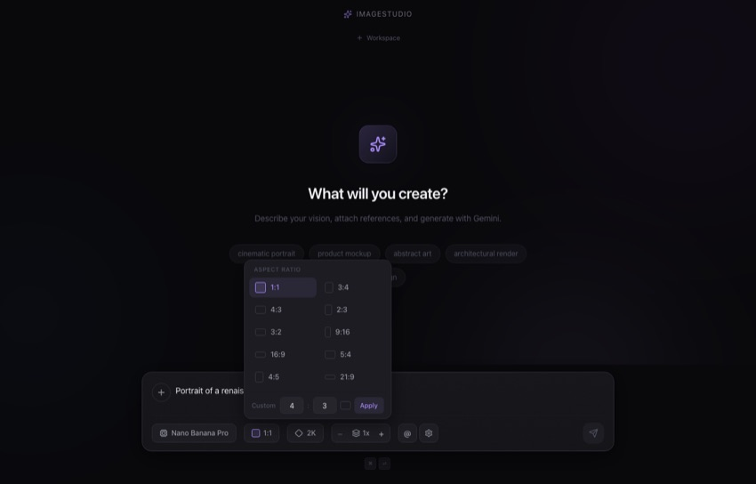
</p>

**Presets:** 1:1, 3:4, 4:3, 2:3, 3:2, 9:16, 16:9, 5:4, 4:5, 21:9

**Custom:** Enter any width:height ratio (e.g. 7:3) and click Apply.

---

## Reference Images & Collections

### Attach reference images

Click the **+** button in the prompt bar or drag & drop images directly onto it. When images are attached, they appear as thumbnails above the text field with a small **+** to add more. Remove all images and the **+** returns inline. These references are sent alongside your prompt for image-to-image editing — style transfer, face swaps, composition matching, etc.

### Crop to Reference

Hover over any gallery image and click the crop icon, or use "Crop as Reference" in the lightbox. This opens a full-screen crop tool where you can draw a selection on the image. The cropped area is added as a reference to your prompt bar — perfect for isolating a face, texture, or detail from an existing generation.

### Asset Collections

Create named groups of reference images (e.g. `@brand-photos`, `@product-shots`). Type **@** in the prompt to mention a collection inline. The images are automatically prepared and attached. Removing the @-mention chip from the text also removes the collection reference — nothing gets sent that you don't see.

<p align="center">
  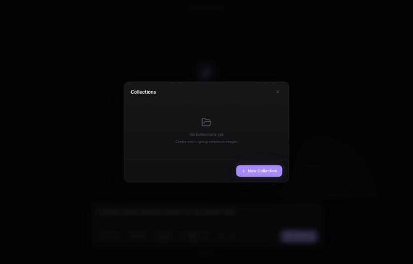
</p>

Collections with more than 5 images are intelligently composited into grid layouts to stay within API limits.

---

## AI Zoom Out

Want to see what's beyond the edges of an image? In the lightbox, use the **Zoom Out** buttons (1.5x, 2x, 3x, 4x) to extend your image outward. ImageStudio creates a canvas with the original image centered and black borders, then sends both the canvas and the original as references — so the AI knows exactly what to fill. The result appears as a new image in your gallery.

---

## AI Upscale

Upscale any image to a higher resolution directly from the lightbox. Available options depend on the original resolution:

- **1K images** → Upscale to 2K or 4K
- **2K images** → Upscale to 4K
- **4K images** → Already at max resolution

Choose which AI model to use for upscaling via the dropdown (defaults to Nano Banana Pro). The original image is sent as a reference with instructions to recreate it at the target resolution while preserving every detail.

> **Note:** Resolution output depends on the AI model. If the API returns a smaller image than requested, ImageStudio automatically detects the actual dimensions and corrects the resolution label in your gallery metadata.

---

## Canvas Generation

Click the **palette icon** in the prompt bar to open the full-screen Canvas editor. Paint a color-coded sketch using multi-layer drawing tools, then let AI turn it into a detailed image.

<p align="center">
  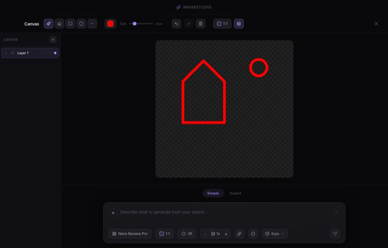
</p>

### Drawing Tools

- **Brush** — freehand drawing with adjustable size and color
- **Eraser** — remove strokes from the active layer
- **Shapes** — rectangle, circle, and line tools with optional fill
- **Color Picker** — 24-color palette + custom hex input
- **Layers** — up to 8 layers with visibility toggle, opacity slider, and drag-to-reorder
- **Undo/Redo** — up to 30 steps of history (⌘Z / ⌘⇧Z)
- **Aspect Ratio** — choose canvas dimensions before you start

### Simple Mode

Write a text prompt at the bottom and generate. Your sketch is automatically attached as a reference — the AI follows your composition, shapes, and color layout.

### Expert Mode

For precise control, switch to Expert mode. An intelligent panel on the right lets you:

- **Detect Colors** — automatically find all unique colors on your canvas
- **Describe each color** — a text field per color to explain what that region represents (e.g. "#FF0000 = red sports car")
- **Attach references** — add images or @-mention collections per color field for visual guidance
- **General description** — overall scene prompt that applies to the whole image
- **Model/Resolution/Count** — full control over generation parameters

All color descriptions are assembled into a structured prompt. Collections are deduplicated across fields — even if you mention the same collection in multiple color descriptions, it's only sent once.

### Compare with Sketch

Canvas-generated images support the **Compare with Original** feature. Your sketch is saved to disk automatically, so you can use the slider or side-by-side view to see your original sketch next to the AI result.

### Keyboard Shortcuts (Canvas)

| Shortcut | Action |
|---|---|
| `B` | Brush tool |
| `E` | Eraser tool |
| `R` | Rectangle tool |
| `C` | Circle tool |
| `L` | Line tool |
| `⌘ Z` | Undo |
| `⌘ ⇧ Z` | Redo |
| `Escape` | Close canvas |

---

## Inpainting

Select any image in the lightbox and click **Inpaint** to open the mask editor. Paint over the area you want to change, then describe what should appear there using the full prompt bar at the bottom.

- **Brush tool** — adjustable size (5–100px), with undo and clear
- **Full prompt bar** — same prompt bar as the main app, with attachments, @-mentions, negative prompt, seed, presets, and multi-model support
- **Reference images** — attach additional images as visual guidance (e.g. "Replace jacket with @image1")
- **Green overlay** — the masked area is sent as a green highlight on the original, so the AI can visually see exactly what to edit
- **Lineage tracking** — inpainted images link back to their source, visible in the detail panel and usable for comparison

---

## Image Comparison

Compare an image with its original version using the **Compare with Original** button in the lightbox. Available for any image that was derived from another (via upscale, zoom out, inpaint, canvas generation, or chat).

- **Slider mode** — both images overlaid with a draggable vertical divider
- **Side-by-side mode** — 50/50 split view with model and resolution labels
- Resolution-independent — images are displayed at the same visual size regardless of pixel dimensions
- **Canvas sketches** — compare your hand-drawn sketch with the AI-generated result

---

## Favorites & Tags

### Favorites

Click the star icon on any gallery card or in the lightbox to mark an image as a favorite. Favorites are persisted across sessions and can be filtered in the gallery toolbar.

### Tags

Add custom tags to any image from the lightbox detail panel. Tags support autocomplete from all existing tags in your gallery. Use tags to organize images by project, theme, or any category you choose — then filter by tag in the gallery toolbar.

---

## Gallery Search & Filters

The gallery toolbar appears above your images with powerful filtering options:

<p align="center">
  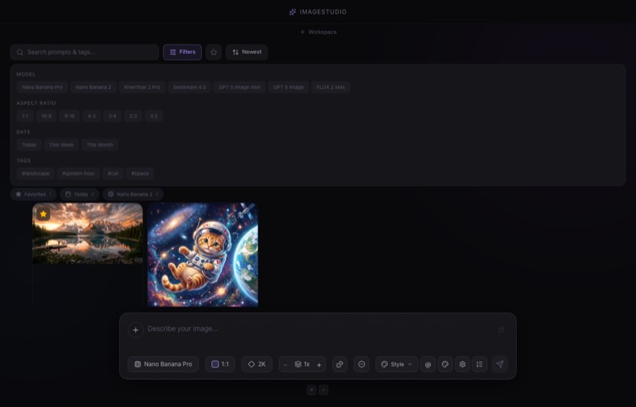
</p>

- **Search** — full-text search across prompts and tags
- **Model filter** — show only images from specific AI models
- **Aspect ratio filter** — filter by aspect ratio
- **Date range** — Today, This Week, This Month
- **Favorites only** — show only starred images
- **Tag filter** — filter by one or more tags
- **Sort** — newest or oldest first
- **Smart albums** — auto-generated album chips for quick access (by model, date, favorites)

All filters can be combined and cleared with one click.

---

## Style Presets

Style presets append predefined style suffixes to your prompt. Click the preset selector in the prompt bar to choose one.

<p align="center">
  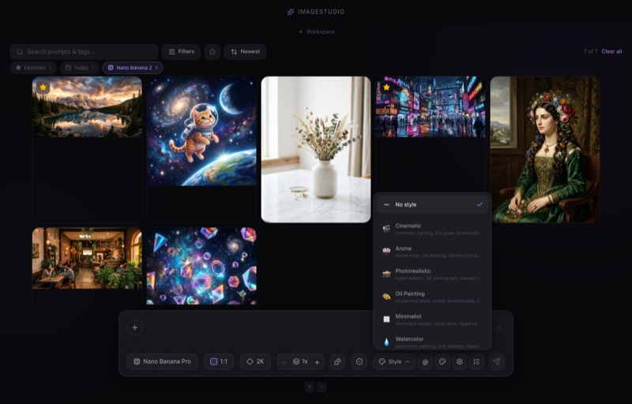
</p>

**Built-in presets:** Cinematic, Anime, Photorealistic, Oil Painting, Minimalist, Watercolor, 3D Render

Create your own custom presets via **Manage Presets** — each preset has a name, optional emoji icon, and a suffix that gets appended to your prompt on generation.

---

## Batch Queue

Add generations to a queue for sequential processing. The generate button includes a dropdown to "Add to Queue" instead of generating immediately.

- **Queue panel** — slide-out panel showing all queued items with progress
- **Sequential processing** — one generation at a time, with progress tracking
- **Persistent** — queue survives app restarts
- **Cancel & clear** — cancel individual items or clear completed ones

---

## Prompt Enhancer

Click the wand icon (✨) next to the prompt editor to have AI improve your prompt. The enhancer adds specific visual details, lighting, composition, and style keywords to make your prompt more effective. The enhanced text replaces your current prompt while preserving any attached images and @-mentions.

---

## EXIF Metadata in Exports

When exporting images, metadata is embedded directly in the file:

- **PNG** — custom `tEXt` chunks with prompt, model, seed, aspect ratio, resolution, and timestamp
- Toggle **"Embed metadata"** in the export popover (on by default)
- Metadata is readable by standard tools like `exiftool` or macOS Get Info

---

## Image Chat Mode

Want to iteratively refine an image? Hover over any image in the gallery and click the chat icon. This opens a conversation where each message builds on the previous result.

<p align="center">
  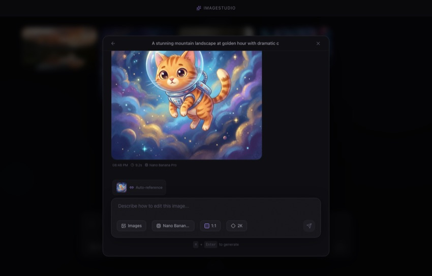
</p>

- The last generated image is automatically attached as a reference
- You can switch models between messages
- You can attach additional reference images
- All chat-generated images also appear in your gallery

When you open a chat from an image, the model that originally created that image is pre-selected — so you continue with the same model by default.

---

## Lightbox & Image Details

Click any image to open it in the lightbox. The info panel on the right shows everything about the image at a glance.

<p align="center">
  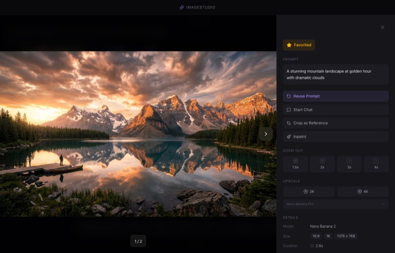
</p>

The info panel includes:

- **Prompt** — with a copy button
- **Model** — which AI model was used (shown as a readable name)
- **Size** — aspect ratio, resolution, and pixel dimensions (resolution auto-corrected to match actual image)
- **Negative prompt** — if one was used
- **Seed** — with a copy button for reproducibility
- **Duration** — how long the generation took
- **Cost** — how much the API call cost (fetched from OpenRouter)
- **Date** — when the image was created
- **Tags** — add/remove custom tags with autocomplete
- **Chat origin** — if the image came from a chat, click to reopen it
- **Reference images** — click to navigate to that image in the lightbox (if it's in your gallery)

### Actions

- **Favorite** — star/unstar the image
- **Reuse Prompt** — restore the prompt, negative prompt, seed, @-collection mentions, and image references back into the prompt bar
- **Start Chat / Continue Chat** — open an editing conversation from this image
- **Crop as Reference** — select a region of the image to use as reference
- **Inpaint** — open the mask editor to selectively edit parts of the image
- **Compare with Original** — slider/side-by-side comparison with the source image (available for upscaled, zoomed, inpainted, canvas-generated, or chat-edited images)
- **Zoom Out** — extend the image outward by 1.5x, 2x, 3x, or 4x using AI
- **Copy** — copy the image to your clipboard
- **Save** — quick export as PNG (with embedded metadata), or click the dropdown arrow to choose format and quality
- **Delete** — remove from your gallery

### Export with format & quality

Click the dropdown arrow next to "Save" to open export options:

- **Format** — PNG, JPEG, or WebP
- **Quality slider** — for JPEG and WebP, adjust from 10% to 100%
- **Live file size** — see the estimated file size update in real time
- **Savings indicator** — shows how much smaller the file is compared to the original

---

## Workspaces

As your gallery grows, workspaces help you stay organized. Think of them as lightweight folders for your images.

<p align="center">
  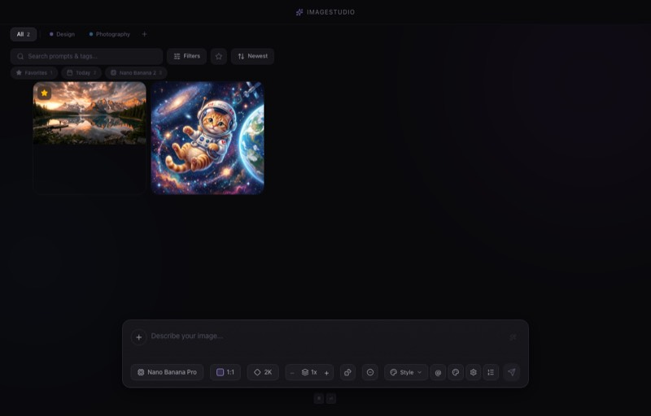
</p>

- **By default, you work without a workspace** — all images are visible
- Click **+ Workspace** below the title bar to create one
- When a workspace is active, new generations automatically go into it
- Move existing images between workspaces via the folder icon on hover
- Switch back to **All** to see everything

Each workspace gets its own color. Images in a workspace show a subtle colored bar at the bottom. Right-click a workspace tab to rename or delete it.

---

## Keyboard Shortcuts

Press **?** anywhere (outside a text input) to see the full shortcuts help overlay.

<p align="center">
  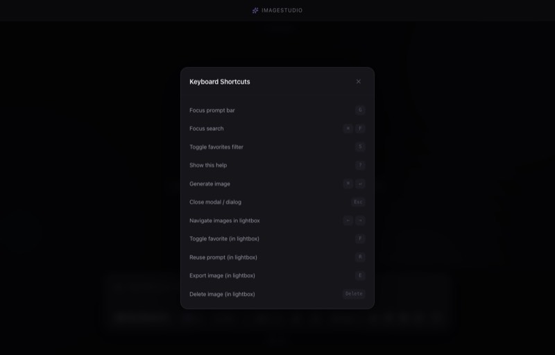
</p>

| Shortcut | Action |
|---|---|
| `⌘ Enter` | Generate images |
| `@` | Reference images/collections in prompt |
| `G` | Focus prompt editor |
| `⌘ F` | Focus search bar |
| `F` | Toggle favorite (in lightbox) |
| `E` | Export (in lightbox) |
| `R` | Reuse prompt (in lightbox) |
| `⌘ C` | Copy image (in lightbox) |
| `Delete` | Delete image (in lightbox) |
| `←` `→` | Navigate images in lightbox |
| `⌘ Z` | Undo brush stroke (in inpaint/canvas) |
| `1`–`4` | Open image 1–4 in gallery |
| `Escape` | Close topmost modal/dialog |
| `?` | Show shortcuts help |

---

## Tech Stack

| Layer | Technology |
|---|---|
| Framework | [Electron](https://www.electronjs.org/) + [electron-vite](https://electron-vite.org/) |
| UI | [React 19](https://react.dev/) + [TypeScript](https://www.typescriptlang.org/) |
| Styling | [Tailwind CSS v4](https://tailwindcss.com/) |
| State | [Zustand](https://zustand.docs.pmnd.rs/) |
| Icons | [Lucide React](https://lucide.dev/) |
| AI | [OpenRouter API](https://openrouter.ai/) |

---

## Architecture

```
src/
├── main/                 # Electron main process
│   ├── ipc/              # IPC handlers (generation, files, settings, metadata)
│   └── services/         # OpenRouter client, image storage, prompt enhancer
├── preload/              # Typed context bridge (window.api)
└── renderer/src/         # React UI
    ├── components/
    │   ├── input/        # PromptBar, ControlsRow, selectors, SeedInput, PresetSelector
    │   ├── gallery/      # Justified layout (row-based masonry), cards, GalleryToolbar, SmartAlbumBar
    │   ├── canvas/       # Canvas editor: modal, workspace, toolbar, layers, color picker, expert mode
    │   ├── chat/         # Image chat modal
    │   ├── workspace/    # Workspace tabs and management
    │   ├── collections/  # Asset collection manager
    │   ├── presets/      # Style presets dialog
    │   ├── queue/        # Batch queue panel
    │   ├── tags/         # Tag input with autocomplete
    │   └── shared/       # Lightbox, CropModal, InpaintModal, ImageCompare, ExportPopover, ShortcutsHelp, Settings
    ├── stores/           # Zustand (gallery, collections, chat, settings, workspace, crop, presets, queue, canvas, gallery-filter)
    ├── hooks/            # useImageGeneration, useChatGeneration, useCanvasRenderer, useJustifiedLayout, useKeyboardShortcuts
    ├── types/            # API types, model definitions, shared interfaces
    └── lib/              # Utils, image compression, date-utils, debounce, logger
```

---

## Releases

Releases are built automatically via GitHub Actions when a version tag is pushed:

```bash
git tag v1.0.0
git push origin v1.0.0
```

This triggers a build on macOS, packages the app as `.dmg` and `.zip`, and creates a GitHub Release with the artifacts and auto-generated changelog.

---

## Data & Privacy

- Your API key is stored locally on your machine
- All generated images are saved as files on disk — metadata is stored in lightweight JSON files (no base64 in memory)
- ImageStudio never sends data anywhere except to OpenRouter for image generation
- **Optional:** If "Send images as URL" is enabled, reference images are temporarily uploaded to [litterbox.catbox.moe](https://litterbox.catbox.moe) (auto-deleted after 1 hour). This is opt-in and off by default.
- Existing data from older versions is automatically migrated on first launch
- No analytics, no tracking, no accounts

---

## License

MIT — free and open source. Do whatever you want with it.

## Contributing

Contributions are welcome. Please open an issue first for major changes.
